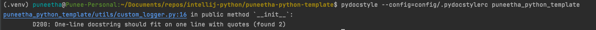
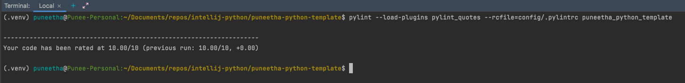
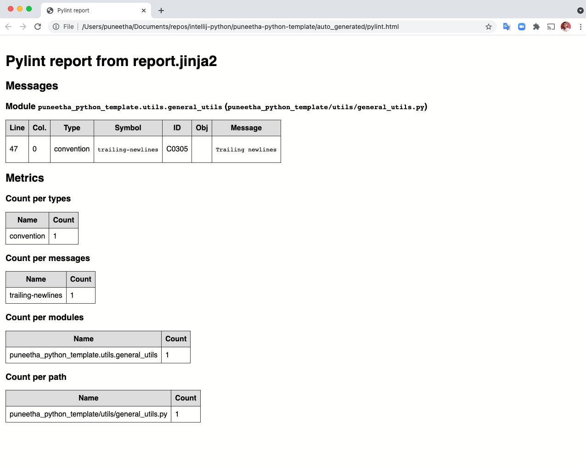
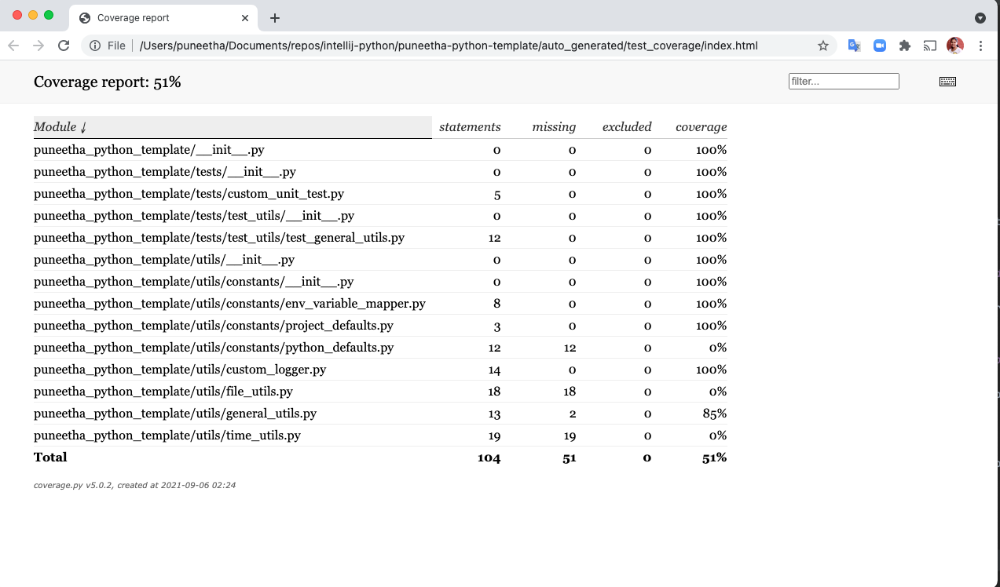
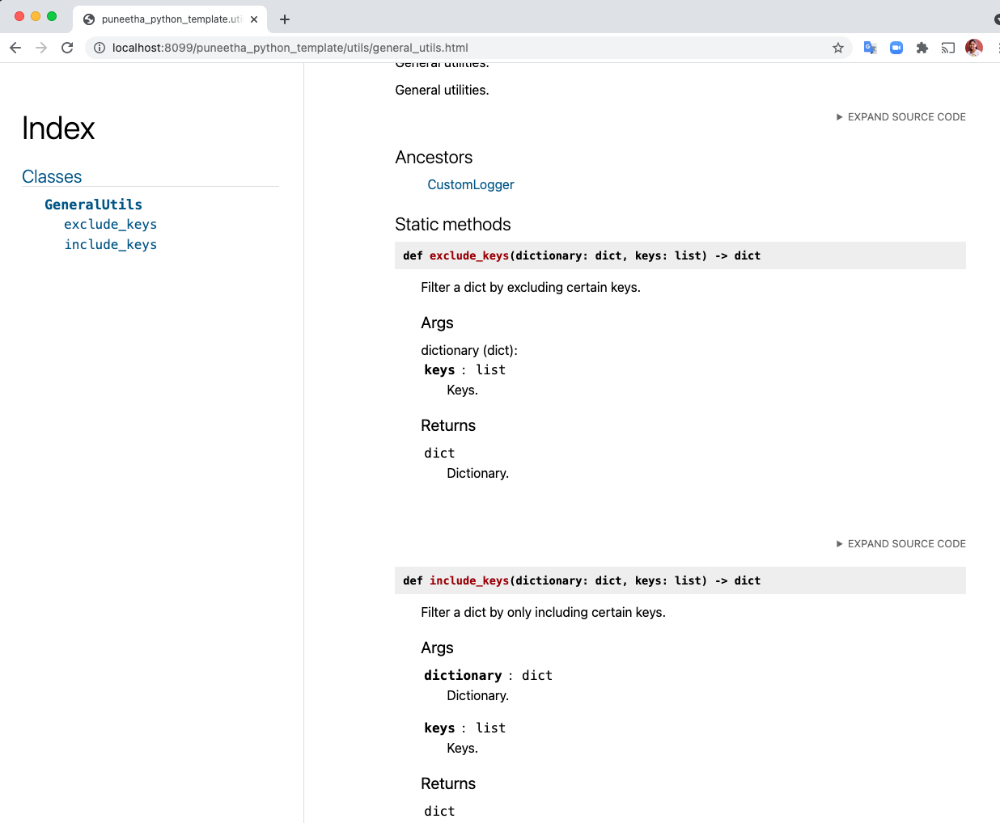
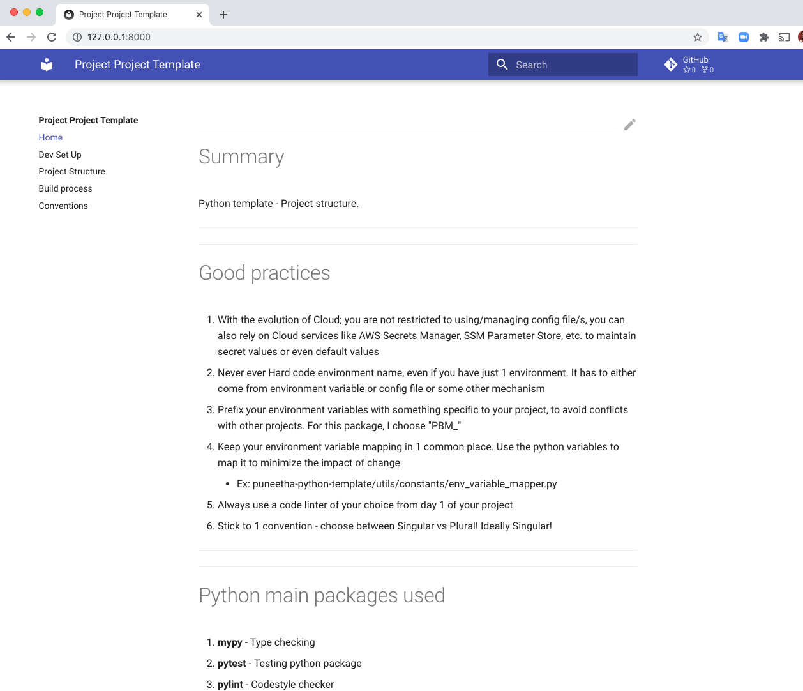

<!--BEGIN-->
---

# Build process

1. Install all the packages listed in requirements.txt file
    ```shell
    pip install -r requirements.txt
    ```

2. Docstring style checker
    ```shell
    # Simple
    pydocstyle <package_name>
    
    # Config
    pydocstyle --config=config/.pydocstylerc <package_name>
    
    # Run pydocstyle for specific folder:
    # Ex: run pydocstyle for folder 'puneetha_python_template/utils'
    PYDOCSTYLE_FILES=$(find puneetha_python_template/utils -type f -name "*.py")
    echo PYDOCSTYLE_FILES
    pydocstyle --config=config/.pydocstylerc $PYDOCSTYLE_FILES
    
    ```

   ## Example view of the pydocstyle run
    ```shell
    pydocstyle --config=config/.pydocstylerc puneetha_python_template
    ```
   **Note**: When everything in package is adhering to standard, it will return no result. This means 100% success!
   

   ## Example view of the pydocstyle run - Error scenario
   

3. Codestyle checker
    ```shell
    # Simple test without config
    pylint <package_name>
    pylint --load-plugins pylint_quotes --rcfile=config/.pylintrc puneetha_python_template
    # Custom config
    pylint --load-plugins pylint_quotes --rcfile=config/.pylintrc <package_name>
    
    # Add processes
    pylint --verbose -j 2 --load-plugins pylint_quotes --rcfile=config/.pylintrc <package_name>
    
    # Run pylint for specific folder - display errors only:
    # Ex: run pylint for folder 'puneetha_python_template/utils'
    PYLINT_FILES=$(find puneetha_python_template/utils -type f -name "*.py")
    echo $PYLINT_FILES
    pylint -E --load-plugins pylint_quotes --rcfile=config/.pylintrc $PYLINT_FILES
    
    ```

   ## Example view of the pylint run
    ```shell
    pylint --load-plugins pylint_quotes --rcfile=config/.pylintrc puneetha_python_template
    ```
   

   ## Export pylint results to html file - example with unnecessary newlines 
    ```shell
    pylint --load-plugins pylint_quotes --rcfile=config/.pylintrc --output-format=json puneetha_python_template | pylint-json2html -o auto_generated/pylint.html
    ```


   

5. Run tests
   ## Run test from config file:
    ```shell
    pytest -c ./config/tox.ini
    ```

   ## Run test from arguments
    ```shell
    pytest -c ./config/tox.ini --cov-report html:auto_generated/coverage --cov=usage
    ```

   ## Run test for specific subpackage folder
    ```shell
    pytest --cache-clear -p no:warnings  -rp --html=auto_generated/pytest_report.html --cov-report html:auto_generated/html_cov --ignore=puneetha_python_template/utils/custom_logger.py puneetha_python_template/utils
    ``` 

   ## Run unittest from command line. Example:
    ```shell
    python -m unittest puneetha_python_template.tests.test_utils.test_general_utils.TestGeneralUtils
    ```
   (or)
    ```shell
    python -m unittest puneetha_python_template/tests/test_utils/test_general_utils.py
    ```

   ## Example view of the generated coverage file
   

6. Generate docstring & publish
   ## Launch the docstring
    ```shell
    pdoc3 puneetha_python_template --http :8099
    ```

   ## Save the docstring to a html file
    ```shell
    pdoc3 puneetha_python_template --force --html -o auto_generated/docstrings
    ```

   ## Example view of the generated file
   

7. Generate mkdocs
   ## Configuration: https://www.mkdocs.org/user-guide/configuration/
   ## Example: https://docs.civicrm.org/dev/en/latest/extensions/documentation/

   ```shell
   # Start server:
   mkdocs serve --config-file ./config/mkdocs.yml
   # Output: Serving on http://127.0.0.1:8000/
   ```

   ## Deploy: https://www.mkdocs.org/user-guide/deploying-your-docs/
   ```shell
   mkdocs gh-deploy --clean --config-file  ./config/mkdocs.yml
   ```

   ## Example view of the generated file
   

8. Build egg file
    ```shell
    python setup.py bdist_egg
   
    # (or) with install
    python setup.py install bdist_egg
    ```

9. Loguru read more [here](https://readthedocs.org/projects/loguru/downloads/pdf/latest/)

---
<!--END-->