# Dev Set up

<!--BEGIN-->
---

## Install Python 3.7
https://www.python.org/downloads/release/python-379/

---
<!--END-->


<!--BEGIN-->
---
## Set up JDK 1.8
1. Download JDK from [here](https://www.oracle.com/uk/java/technologies/javase/javase-jdk8-downloads.html)
   
2. Set JAVA_HOME:
    - Linux/Mac instructions [here](https://confluence.atlassian.com/adminjiraserver073/installing-java-861253016.html#InstallingJava-Linux-basedcomputers)
    - Windows instructions [here](https://confluence.atlassian.com/doc/setting-the-java_home-variable-in-windows-8895.html)

---
<!--END-->


<!--BEGIN-->
---
## Download and Install Pycharm community edition
https://www.jetbrains.com/pycharm/download

## Pycharm setting - Set up python virtual environment interpreter
**Note:**
   - Make sure name is ".venv", as this is already set in .gitignore as a file to be ignored while committing to git. Else choose the name and make sure to add it to gitignore
   - Close and open the terminal after this step to switch to ".venv"

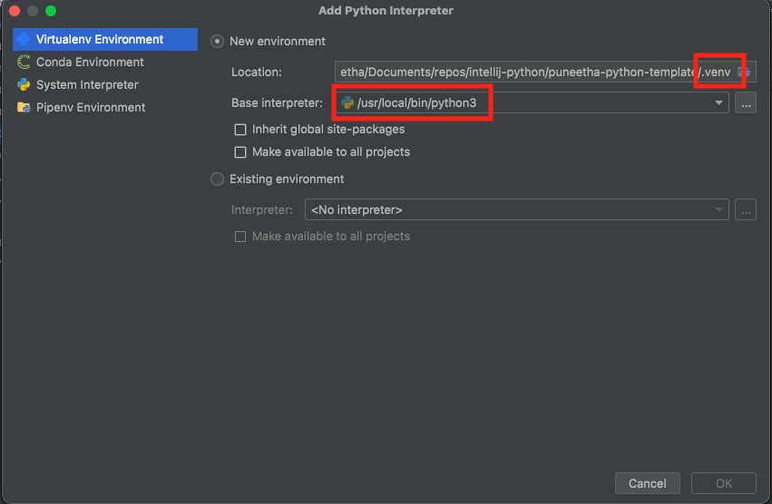

## Pycharm setting - Set up integrated tools like test runner, docstring format, etc.

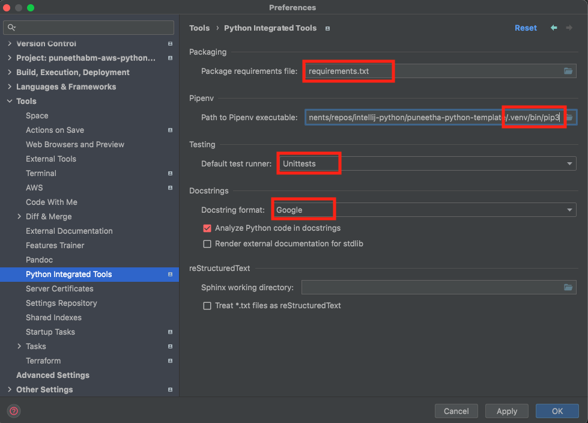

## Pycharm setting - Point to pylint config file

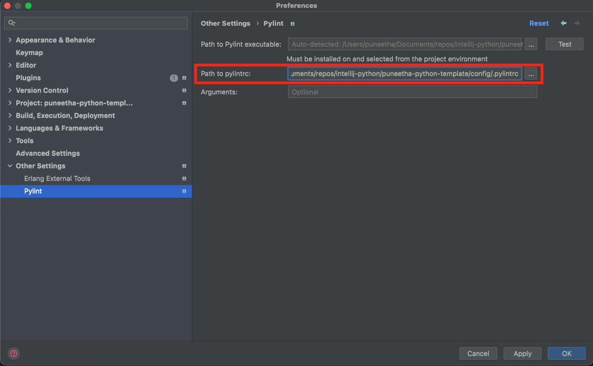

## Pycharm setting - Make sure to include the main package name for import to pick up the auto-completion of your package name

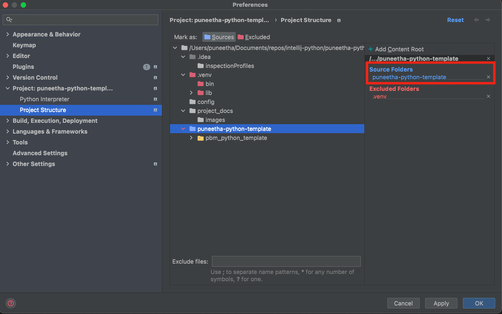

---
<!--END-->


<!--BEGIN-->
---
## Upgrade pip
**Note:** Open terminal in PyCharm
```shell
python -m pip install -U pip
```
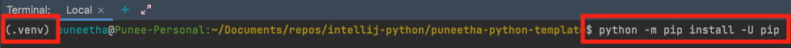

---
<!--END-->


<!--BEGIN-->
---
## Set below Environment variables in three sections

1. Key: PBM_LOG_FILE_PATH
   - Value example: "/var/log/data-engineering.log"

**Note:** More environment variables information is [in this python environment mapper file](../puneetha_python_template/pbm_python_template/utils/constants/env_variable_mapper.py)

### Section 1: Set environment variables for running the programs
Go to Run -> Edit Configurations -> Templates -> Python
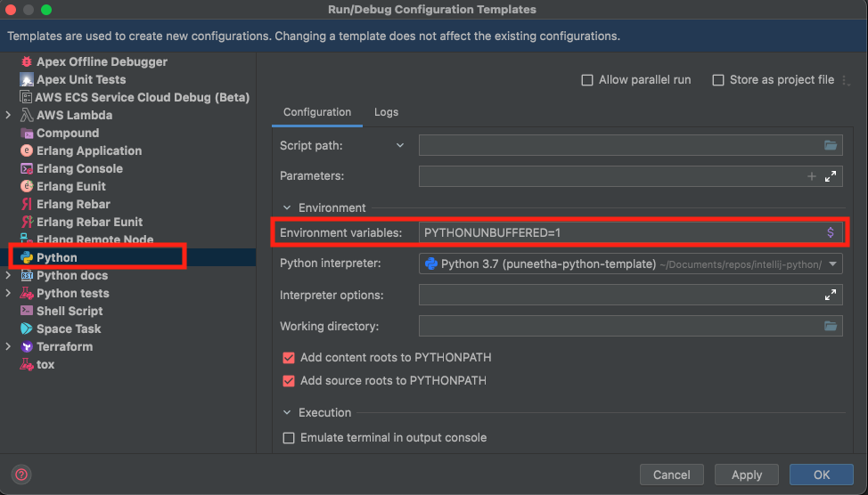

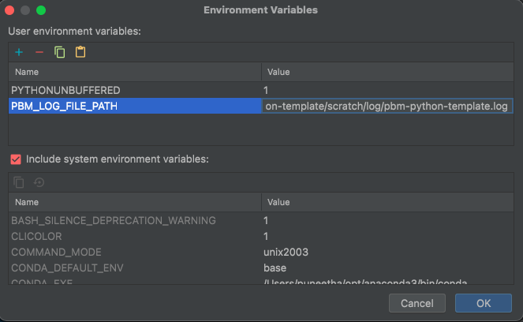

### Section 2: Set environment variables for test cases
Go to Run -> Edit Configurations -> Templates -> Python tests -> Unittests
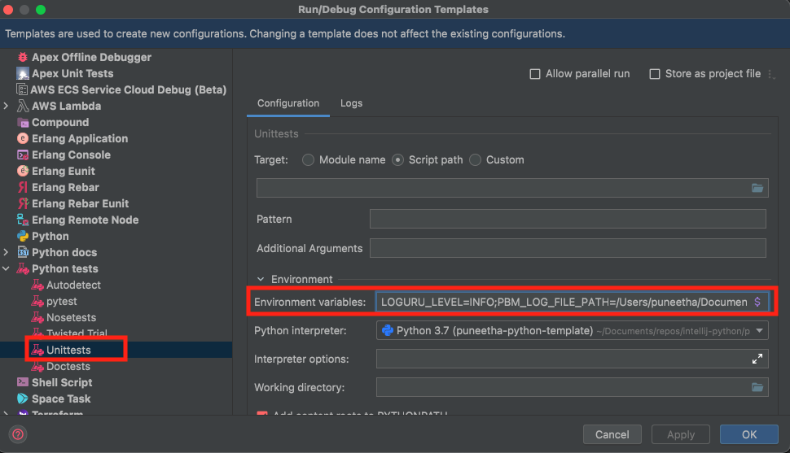

### Section 3: Set environment variables for running commands in terminal
Go to Preferences -> Tools -> Terminal -> 
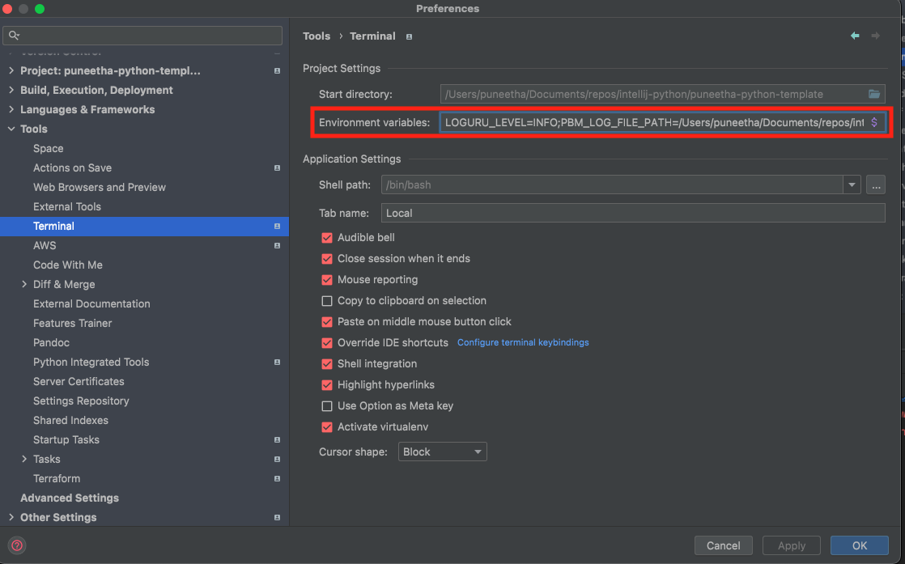

**Note:** Environment variable values need not be same for all 3 sections. In-fact, they are meant to be different.
   For example, you might want to set log level to DEBUG in some cases.

---
<!--END-->


<!--BEGIN-->
---
## Install python packages
**Note:** Open terminal in PyCharm
```shell
pip install -r requirements.txt
```
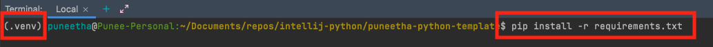

---
<!--END-->


<!--BEGIN-->
---
## Enable pre-commit

Use the pre-commit hook for linting staged files prior to a commit (mandatory, triggers pydocstyle and pylint)
```shell
pre-commit install --hook-type pre-commit
```

## Example
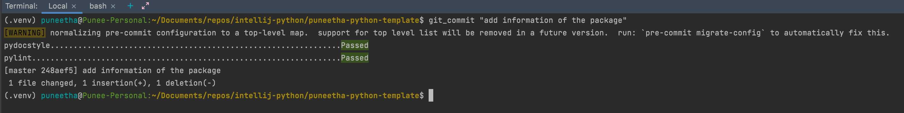
---
<!--END-->


<!--BEGIN-->
---
## Git helpers
1. Run below to save credentials - to avoid entering credentials for every push
```shell
git config credential.helper store
```

2. Allow long file name
```shell
git config core.longpaths true
```

---
<!--END-->
